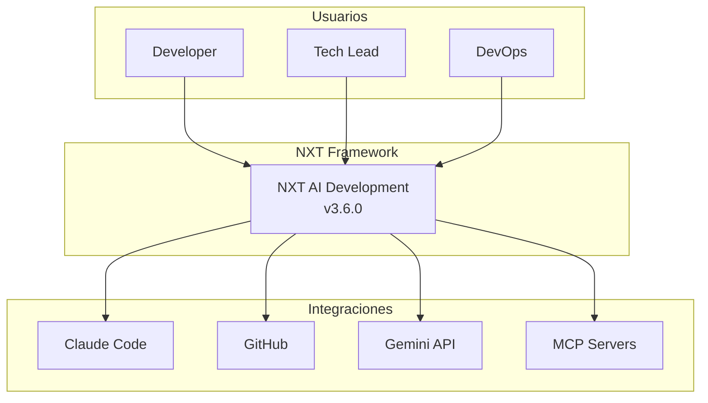
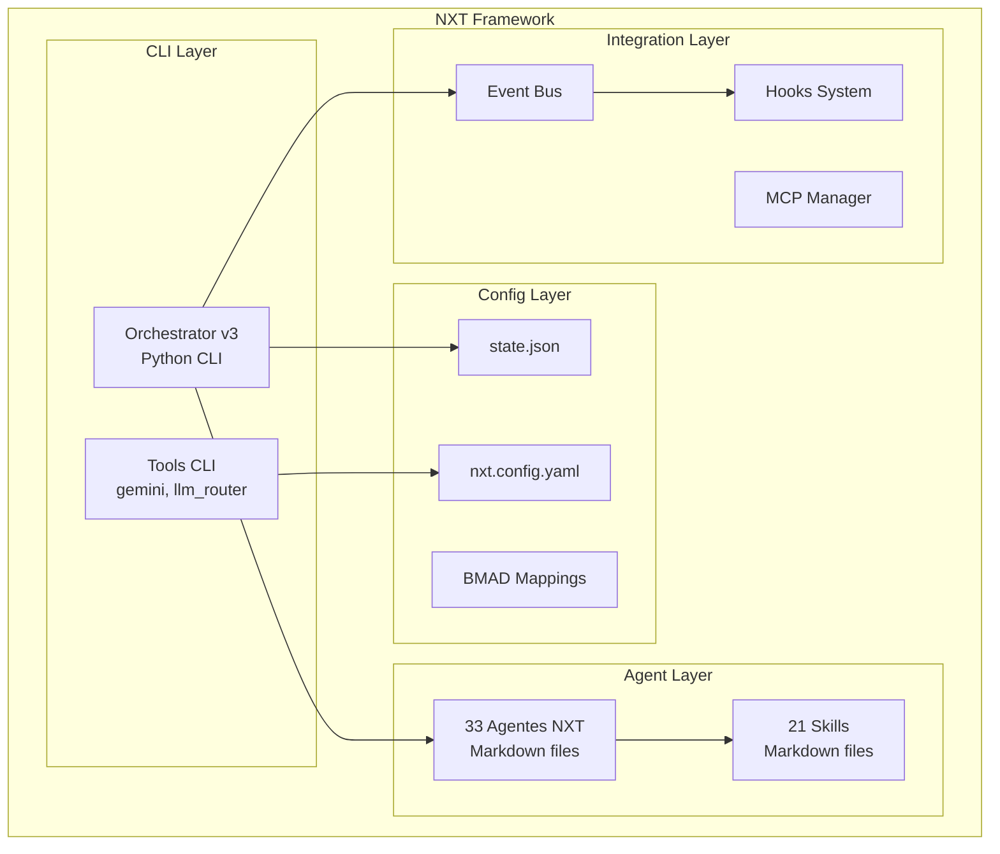
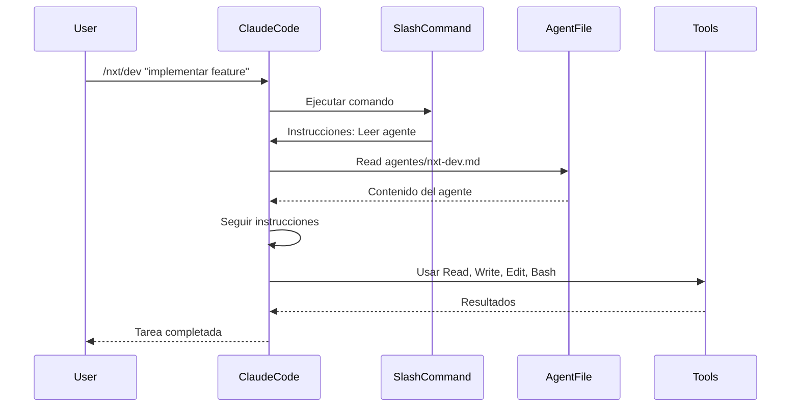
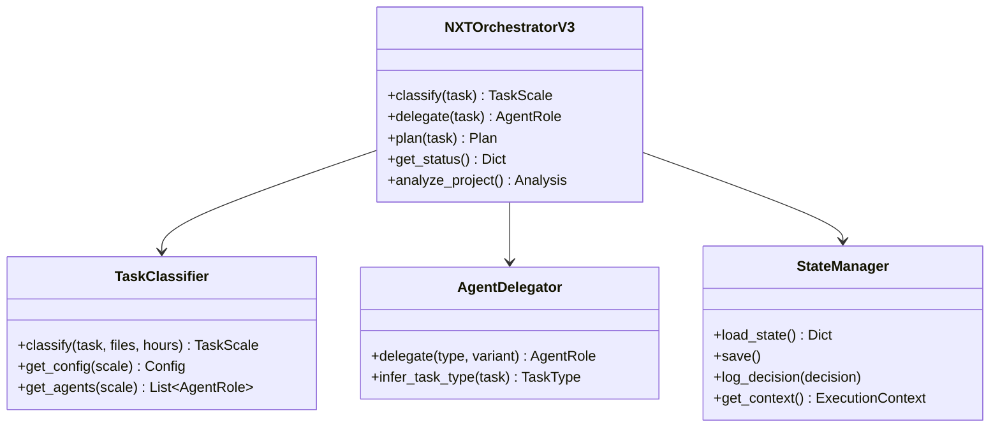

# Arquitectura: NXT AI Development Framework v3.6.0

> **Generado por:** NXT Architect
> **Fecha:** 2026-01-27
> **Estado:** Revisión de arquitectura existente + mejoras propuestas

## 1. Vista General

### 1.1 Contexto (C4 Level 1)



### 1.2 Contenedores (C4 Level 2)



## 2. Tech Stack Actual

| Capa | Tecnología | Justificación |
|------|------------|---------------|
| **Runtime** | Python 3.10+ | Amplio ecosistema, CLI nativo |
| **CLI Framework** | argparse | Built-in, sin dependencias |
| **Config** | YAML/JSON | Human-readable, editable |
| **Agentes** | Markdown | Portables, versionables, legibles |
| **Testing** | pytest | Estándar Python |
| **LLM Principal** | Claude Opus 4.5 | Mejor para código y razonamiento |
| **LLM Secundario** | Gemini 3 Pro | Búsquedas, multimedia |
| **IDE** | Claude Code | Ejecución directa de agentes |

## 3. Componentes Principales

### 3.1 Orchestrator v3 (`nxt_orchestrator_v3.py`)

**Responsabilidades:**
- Clasificación de tareas en 5 niveles BMAD
- Delegación inteligente a agentes
- Planificación de workflows
- Gestión de estado

**Clases principales:**
```
NXTOrchestratorV3
├── TaskClassifier (5 niveles BMAD)
├── AgentDelegator (33 agentes)
├── WorkflowGraph (LangGraph pattern)
├── StateManager (persistencia)
├── HookManager (4 hooks)
├── AgentRegistry (NXT + BMAD)
├── SkillRegistry (21 skills)
└── WorkflowRegistry (26 workflows)
```

### 3.2 Sistema de Agentes

```
agentes/
├── nxt-orchestrator.md    # Director
├── nxt-analyst.md         # Fase: Descubrir
├── nxt-pm.md              # Fase: Definir
├── nxt-architect.md       # Fase: Diseñar
├── nxt-ux.md              # Fase: Diseñar
├── nxt-dev.md             # Fase: Construir
├── nxt-qa.md              # Fase: Verificar
├── nxt-devops.md          # Deployment
├── ... (33 total)
```

### 3.3 Event Bus (`event_bus.py`)

**Eventos soportados:**
- TASK_CLASSIFIED
- TASK_PLANNED
- AGENT_ACTIVATED
- STEP_COMPLETED
- WORKFLOW_COMPLETED

### 3.4 State Manager

**Archivo:** `.nxt/state.json`

```json
{
  "framework_version": "3.5.0",
  "current_phase": "init",
  "current_context": null,
  "completed_tasks": [],
  "pending_tasks": [],
  "active_agents": [],
  "decisions_log": [],
  "integration_status": {...},
  "capabilities": {...}
}
```

## 4. Flujo de Ejecución v3.4.0+ (Ejecución Directa)



## 5. Decisiones de Arquitectura (ADRs)

### ADR-001: Ejecución Directa (v3.4.0)
- **Estado**: Aceptado
- **Contexto**: Claude CLI externo requería API key adicional
- **Decisión**: Slash commands instruyen a Claude para leer agentes y ejecutar directamente
- **Consecuencias**:
  - (+) No requiere API key externa
  - (+) Más simple para usuarios
  - (-) Requiere Claude Code

### ADR-002: 5 Niveles BMAD
- **Estado**: Aceptado
- **Contexto**: Bug fix/Feature/Epic era muy simple
- **Decisión**: Sistema de 5 niveles (0-4) con tracks específicos
- **Consecuencias**:
  - (+) Mejor granularidad
  - (+) Workflows más precisos
  - (-) Más complejidad en clasificación

### ADR-003: Multi-LLM (Claude + Gemini)
- **Estado**: Aceptado
- **Contexto**: Claude no tiene búsqueda web ni generación de imágenes
- **Decisión**: Gemini para búsquedas y multimedia
- **Consecuencias**:
  - (+) Capacidades complementarias
  - (-) Dos API keys necesarias

## 6. Mejoras Propuestas v3.6.0

### 6.1 Validador de Consistencia

```python
# Nuevo: herramientas/consistency_validator.py
class ConsistencyValidator:
    def validate_versions(self) -> List[Issue]
    def validate_agents(self) -> List[Issue]
    def validate_skills(self) -> List[Issue]
    def generate_report(self) -> Report
```

### 6.2 GitHub Actions

```yaml
# .github/workflows/ci.yml
name: CI
on: [push, pull_request]
jobs:
  test:
    runs-on: ubuntu-latest
    steps:
      - uses: actions/checkout@v4
      - uses: actions/setup-python@v5
      - run: pip install -r requirements.txt
      - run: pytest --cov=herramientas
```

### 6.3 Dockerfile

```dockerfile
FROM python:3.11-slim
WORKDIR /app
COPY requirements.txt .
RUN pip install --no-cache-dir -r requirements.txt
COPY . .
ENTRYPOINT ["python", "herramientas/nxt_orchestrator_v3.py"]
```

## 7. Consideraciones de Seguridad

- **API Keys**: Almacenadas en `.env`, nunca en código
- **State File**: No contiene datos sensibles
- **Agentes**: Solo markdown, sin ejecución directa de código
- **MCP**: Requiere configuración explícita

## 8. Escalabilidad

| Aspecto | Actual | Escalable a |
|---------|--------|-------------|
| Agentes | 33 | 100+ (modular) |
| Skills | 21 | 50+ |
| Workflows | 26 | Ilimitado |
| Usuarios concurrentes | 1 | 1 (diseño single-user) |

## 9. Diagrama de Clases Simplificado



---

*Generado por NXT Architect - Fase DISEÑAR*
