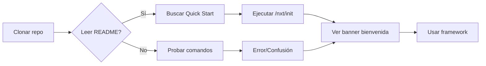
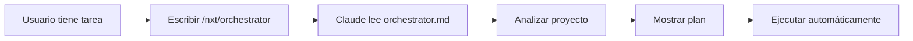

# UX Audit: NXT AI Development Framework v3.6.0

> **Generado por:** NXT UX
> **Fecha:** 2026-01-27
> **Tipo:** Auditoría de Experiencia de Usuario para CLI y Documentación

## 1. Executive Summary

El framework NXT presenta una **buena base de UX** con banners informativos, mensajes claros y estructura organizada. Sin embargo, hay oportunidades de mejora en consistencia visual, feedback de errores y onboarding.

**Score UX Global:** 7.2/10

## 2. Análisis de User Flows

### 2.1 Flow: Nuevo Usuario (Onboarding)



**Issues detectados:**
- No hay Quick Start prominente en README
- `/nxt/init` no existe como comando
- Confusión entre `python herramientas/...` y `/nxt/...`

### 2.2 Flow: Ejecutar Tarea



**Issues detectados:**
- Usuario no sabe si debe usar slash command o CLI Python
- Falta feedback visual durante análisis largo

## 3. Heurísticas de Nielsen

### H1: Visibilidad del Estado del Sistema
**Score: 7/10**

| Aspecto | Estado | Recomendación |
|---------|--------|---------------|
| Banners de agentes | Bien | Mantener |
| Progreso de tareas | Regular | Agregar spinners |
| Estado del proyecto | Bien | `status` funciona |

### H2: Coincidencia Sistema-Mundo Real
**Score: 8/10**

| Aspecto | Estado | Recomendación |
|---------|--------|---------------|
| Nomenclatura | Bien | Términos familiares |
| Iconos | Bien | Emojis apropiados |
| Metáforas | Bien | "Agentes", "Fases" |

### H3: Control y Libertad del Usuario
**Score: 6/10**

| Aspecto | Estado | Recomendación |
|---------|--------|---------------|
| Cancelar operación | Falta | Agregar Ctrl+C handling |
| Deshacer | N/A | No aplica |
| Modo verbose | Falta | Agregar --verbose |

### H4: Consistencia y Estándares
**Score: 5/10**

| Aspecto | Estado | Recomendación |
|---------|--------|---------------|
| Versiones | Mal | Sincronizar todo a 3.5.0 |
| Banners | Inconsistente | Unificar formato |
| Comandos | Regular | Documentar todos |

### H5: Prevención de Errores
**Score: 7/10**

| Aspecto | Estado | Recomendación |
|---------|--------|---------------|
| Validación entrada | Bien | argparse valida |
| Confirmaciones | Bien | No hace destructivo sin aviso |
| Defaults seguros | Bien | Defaults conservadores |

### H6: Reconocimiento vs Recuerdo
**Score: 6/10**

| Aspecto | Estado | Recomendación |
|---------|--------|---------------|
| Ayuda contextual | Regular | Agregar `--help` detallado |
| Autocompletado | Falta | Agregar shell completions |
| Ejemplos | Regular | Más ejemplos en docs |

### H7: Flexibilidad y Eficiencia
**Score: 7/10**

| Aspecto | Estado | Recomendación |
|---------|--------|---------------|
| Shortcuts | Regular | Aliases para comandos largos |
| Config | Bien | YAML configurable |
| Batch operations | Falta | Agregar modo batch |

### H8: Diseño Estético y Minimalista
**Score: 8/10**

| Aspecto | Estado | Recomendación |
|---------|--------|---------------|
| Output | Bien | Limpio, estructurado |
| Colores | Regular | Agregar colores semánticos |
| Información relevante | Bien | No hay ruido |

### H9: Ayuda para Reconocer Errores
**Score: 6/10**

| Aspecto | Estado | Recomendación |
|---------|--------|---------------|
| Mensajes de error | Regular | Más específicos |
| Sugerencias | Falta | "Did you mean...?" |
| Códigos de error | Falta | Exit codes documentados |

### H10: Documentación y Ayuda
**Score: 7/10**

| Aspecto | Estado | Recomendación |
|---------|--------|---------------|
| README | Regular | Actualizar con v3.6.0 |
| CLAUDE.md | Bien | Completo |
| In-line help | Regular | Mejorar --help |

## 4. Propuestas de Mejora UX

### 4.1 Banner Unificado (Template)

```
╔══════════════════════════════════════════════════════════════════╗
║                                                                  ║
║   [EMOJI] NXT [NOMBRE] v3.6.0                                   ║
║                                                                  ║
║   "[Tagline del agente]"                                        ║
║                                                                  ║
║   Fase: [FASE]                                                  ║
║   Entregables: [Lista]                                          ║
║                                                                  ║
║   Comandos: /nxt/help | Docs: docs/                             ║
║                                                                  ║
╚══════════════════════════════════════════════════════════════════╝
```

### 4.2 Output con Colores (CLI)

```python
# Propuesta: Colores semánticos
SUCCESS = "\033[92m"  # Verde
WARNING = "\033[93m"  # Amarillo
ERROR = "\033[91m"    # Rojo
INFO = "\033[94m"     # Azul
RESET = "\033[0m"

print(f"{SUCCESS}✓ Tarea completada{RESET}")
print(f"{ERROR}✗ Error: {message}{RESET}")
print(f"{WARNING}⚠ Advertencia: {message}{RESET}")
```

### 4.3 Mensajes de Error Mejorados

**Actual:**
```
{"error": "Agente no encontrado: nxt-xyz"}
```

**Propuesto:**
```
✗ Error: Agente 'nxt-xyz' no encontrado

  Agentes similares:
    • nxt-ux
    • nxt-qa
    • nxt-dev

  Usa 'python herramientas/nxt_orchestrator_v3.py agents' para ver todos.
```

### 4.4 Quick Start en README

```markdown
## Quick Start (2 minutos)

# 1. Activa el orquestador
/nxt/orchestrator

# 2. O ejecuta un agente específico
/nxt/dev "implementar login"

# 3. Ver estado
python herramientas/nxt_orchestrator_v3.py status
```

## 5. Checklist de Mejoras UX

### Prioridad Alta
- [ ] Sincronizar versiones en todos los banners (v3.6.0)
- [ ] Agregar Quick Start al README
- [ ] Unificar formato de banners en 33 agentes
- [ ] Mejorar mensajes de error con sugerencias

### Prioridad Media
- [ ] Agregar colores al output CLI
- [ ] Mejorar --help de comandos
- [ ] Documentar exit codes
- [ ] Agregar spinner para operaciones largas

### Prioridad Baja
- [ ] Shell completions (bash/zsh)
- [ ] Modo verbose (--verbose)
- [ ] Aliases para comandos largos

## 6. Wireframes CLI

### Estado Actual
```
$ python herramientas/nxt_orchestrator_v3.py status
{
  "version": "3.6.0",
  ...
}
```

### Propuesta Mejorada
```
$ nxt status

╭─────────────────────────────────────────────────────────╮
│  🎯 NXT Framework v3.6.0                                │
├─────────────────────────────────────────────────────────┤
│  Estado: ✓ Listo                                        │
│  Agentes: 33 NXT + 12 BMAD                              │
│  Skills: 21                                             │
│  Workflows: 26                                          │
│                                                         │
│  Última tarea: "implementar auth" (completada)          │
│  Contexto actual: ninguno                               │
╰─────────────────────────────────────────────────────────╯

Siguiente paso sugerido: /nxt/orchestrator
```

## 7. Métricas de UX Objetivo

| Métrica | Actual | Objetivo v3.6.0 |
|---------|--------|-----------------|
| Tiempo hasta primer comando | ~5 min | < 2 min |
| Comandos hasta éxito | ~3 | 1-2 |
| Score Nielsen promedio | 6.6 | 7.5+ |
| Banners consistentes | 0% | 100% |

---

*Generado por NXT UX - Fase DISEÑAR*
