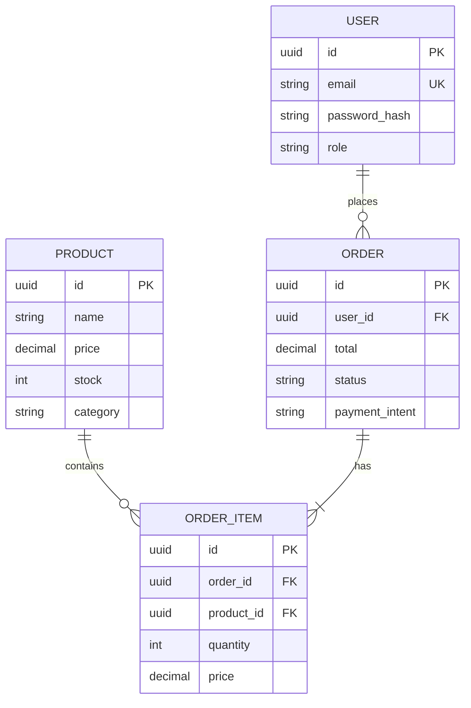

# Ejemplo: API REST

Este ejemplo muestra como usar NXT AI Development para desarrollar una API REST completa.

## Escenario

Crear una API REST para un sistema de e-commerce con:
- Autenticacion y autorizacion
- CRUD de productos
- Gestion de ordenes
- Integracion con pasarela de pagos
- Webhooks

## Flujo de Trabajo

### 1. Inicializar Proyecto

```
/nxt/orchestrator
```

### 2. Investigar Requisitos

```
/nxt/analyst

# Usar Gemini para investigar
python herramientas/gemini_tools.py search "best practices REST API design 2025"
python herramientas/gemini_tools.py search "payment gateway integration patterns"
```

### 3. Crear PRD

```
/nxt/pm
*create-prd

Producto: E-commerce API
Usuarios: Desarrolladores frontend, apps mobile
Requisitos principales:
- Authentication: JWT + refresh tokens
- Products: CRUD completo
- Orders: Create, list, update status
- Payments: Stripe integration
- Webhooks: Eventos de pago
```

### 4. Disenar Arquitectura

```
/nxt/architect
*architecture
*api-design
```

Genera:
- Diagramas C4
- Endpoints REST
- Modelos de datos
- ADRs

### 5. Implementar

```
/nxt/dev
*story-context US-001
*dev-story US-001
```

## Estructura de la API

### Endpoints Principales

```
Authentication
POST   /api/auth/register
POST   /api/auth/login
POST   /api/auth/refresh
POST   /api/auth/logout

Products
GET    /api/products
GET    /api/products/:id
POST   /api/products
PUT    /api/products/:id
DELETE /api/products/:id

Orders
GET    /api/orders
GET    /api/orders/:id
POST   /api/orders
PATCH  /api/orders/:id/status

Payments
POST   /api/payments/create-intent
POST   /api/webhooks/stripe
```

### Modelo de Datos



## Tech Stack

| Capa | Tecnologia | Razon |
|------|------------|-------|
| Runtime | Node.js 20 | Performance, ecosystem |
| Framework | Express | Simple, flexible |
| Database | PostgreSQL | ACID, features |
| ORM | Prisma | Type-safe, DX |
| Auth | JWT | Stateless |
| Validation | Zod | Runtime type checking |
| Docs | OpenAPI | Standard |
| Testing | Jest + Supertest | Complete coverage |

## Estructura del Proyecto

```
ecommerce-api/
├── src/
│   ├── config/
│   │   ├── database.ts
│   │   ├── env.ts
│   │   └── stripe.ts
│   ├── controllers/
│   │   ├── auth.controller.ts
│   │   ├── products.controller.ts
│   │   └── orders.controller.ts
│   ├── middleware/
│   │   ├── auth.middleware.ts
│   │   ├── error.middleware.ts
│   │   └── validation.middleware.ts
│   ├── models/
│   │   └── prisma/schema.prisma
│   ├── routes/
│   │   ├── auth.routes.ts
│   │   ├── products.routes.ts
│   │   └── orders.routes.ts
│   ├── services/
│   │   ├── auth.service.ts
│   │   ├── payment.service.ts
│   │   └── order.service.ts
│   ├── utils/
│   │   ├── jwt.ts
│   │   └── errors.ts
│   └── app.ts
├── tests/
│   ├── unit/
│   └── integration/
├── docs/
│   └── openapi.yaml
└── package.json
```

## Comandos Utiles

```bash
# Buscar documentacion de Stripe
python herramientas/gemini_tools.py search "Stripe API webhooks best practices"

# Verificar patterns
python herramientas/gemini_tools.py url "https://stripe.com/docs/webhooks" "como manejar webhooks"

# Router para decidir LLM
python herramientas/llm_router.py route "generar documentacion OpenAPI"
```

## Testing

### Unit Tests
```bash
npm test -- --coverage
```

### Integration Tests
```bash
npm run test:integration
```

### Test Plan
Ver `docs/4-implementation/qa/test-plan.md`

## Deploy

### Variables de Entorno
```env
DATABASE_URL=postgresql://...
JWT_SECRET=...
STRIPE_SECRET_KEY=sk_...
STRIPE_WEBHOOK_SECRET=whsec_...
```

### Docker
```dockerfile
FROM node:20-alpine
WORKDIR /app
COPY package*.json ./
RUN npm ci --only=production
COPY dist ./dist
CMD ["node", "dist/app.js"]
```

## Resultado Esperado

- API REST completamente funcional
- Documentacion OpenAPI
- Tests con >80% cobertura
- Ready for production

---

*Ejemplo generado con NXT AI Development*
